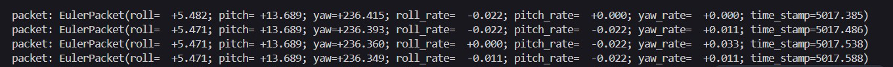
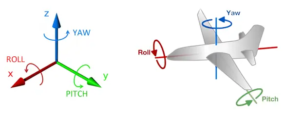

<p align="center"></p>
<h1 align="center"> RSX-UM7 Orientation Sensor </h1> 
<h4 align="right">April 24</h4>

   
 

<br>


El sensor de orientación UM7 es un sistema de referencia de actitud y rumbo (AHRS) de cuarta generación. Combina datos de un acelerómetro de tres ejes, un giroscopio y un magnetómetro para producir estimaciones de actitud y rumbo.

El UM7 se conecta al software de interfaz de serie para permitir el trazado en tiempo real de los datos del sensor, el registro, la configuración del dispositivo y la calibración del magnetómetro.
Si no es necesario medir el ángulo de yaw, generalmente no es necesario calibrar el magnetómetro. Sin embargo, si el UM7 está funcionando en modo cuaternión, siempre se requiere la calibración del magnetómetro para un funcionamiento correcto

# PinOut

<p align="center"></p>

> :memo: **Note:** Si se usa FTDI el Tx UM7 --> Rx FTDI, Rx UM7 --> Tx FTDI

<br>

# Testing on Python 
## Pre-requisito Modulo comunicación Serial
```
python3 -m pip install pyserial
```
o 
```
pip install pyserial
```
si da error por no tener pip resuelvelo:
```
sudo apt install python3-pip
```

## Testing
```
sudo pip install rsl-comm-py
```
more info: https://github.com/RedshiftLabsPtyLtd/rsl_comm_py

## Windows (usando FTDI convertidor)
Reading the Euler angles broadcast packets. Conociendo el puerto COM desde el Adminitrador de dispositivo de Windows.
```python
from rsl_comm_py import UM7Serial
um7_serial = UM7Serial(port_name='COM3')
for packet in um7_serial.recv_euler_broadcast():
    print(f"packet: {packet}")
```
El puerto COM dependera de cual le asigne el sistema operativo. 

<br>

## Linux (usando FTDI convertidor)
Reading the Euler angles broadcast packets. Para ver donde esta la IMU conectada USB
```
ls /dev/tty* | grep USB
```
La respuesta se algo como  ```/dev/ttyUSB*```

```python
from rsl_comm_py import UM7Serial
um7_serial = UM7Serial(port_name='/dev/ttyUSB0')
for packet in um7_serial.recv_euler_broadcast():
    print(f"packet: {packet}")
```
> :memo: **Note:** En RPi si se conecta si el FTDI al bus serial el puerto puede cambiar ej: ```/dev/ttyS0```

> :memo: **Note:** Es posible configurar el serial del dispositivo y conectarse al UM7 sin importar que puerto le asigne el OS.

<p align="center"></p>

## Test 2
Reading the raw sensor data broadcast packets
```python
from rsl_comm_py import UM7Serial
um7_serial = UM7Serial(port_name='COM7')
for packet in um7_serial.recv_all_raw_broadcast():
    print(f"packet: {packet}")
```

<p align="center"></p>

<br>

Reading 100 processed sensor data broadcast packets
```python
from rsl_comm_py import UM7Serial
um7_serial = UM7Serial(port_name='COM7')
for packet in um7_serial.recv_all_proc_broadcast(num_packets=100):
    print(f"packet: {packet}")
```
<p align="center"></p>


## Split data packet
Hace un bucle infinito guardando los valores de Yaw, Roll y Pitch en variables separadas
```python
from rsl_comm_py import UM7Serial
um7_serial = UM7Serial(port_name='COM7')
for packet in um7_serial.recv_euler_broadcast():
    # Accede a los atributos del paquete para obtener los valores de pitch, roll y yaw
    pitch = packet.pitch
    roll = packet.roll
    yaw = packet.yaw
    
     # Imprime los valores de pitch, roll y yaw por separado
    print(f"Pitch: {pitch}, Roll: {roll}, Yaw: {yaw}")
```


Lee los datos en una sola oportunidad sin un bucle infinito

```python
from rsl_comm_py import UM7Serial

# Inicializa la comunicación con el sensor UM7 en el puerto COM7
um7_serial = UM7Serial(port_name='COM7')

# Recibe el primer paquete de ángulos de Euler del sensor UM7
packet = next(um7_serial.recv_euler_broadcast())

# Accede a los atributos del paquete para obtener los valores de pitch, roll y yaw
pitch = packet.pitch
roll = packet.roll
yaw = packet.yaw

# Imprime los valores de pitch, roll y yaw
print(f"Pitch: {pitch}, Roll: {roll}, Yaw: {yaw}")
```
<br>

# Demo UM7
demo-UM7.py draw rotating cube using OpenGL using euler angle representation received over serial port.

## Install Library
```
sudo pip install rsl-comm-py
sudo pip install pygame
sudo pip install pyopengl
```
demo-UM7.py:
```python
"""
Author  carjavi <carjavi@hotmail.com>
------

    demo-UM7 draw rotating cube using OpenGL using euler angle representation received over serial port.

    Source code:https://github.com/thecountoftuscany/PyTeapot-Quaternion-Euler-cube-rotation  
"""

import pygame
import math
from OpenGL.GL import *
from OpenGL.GLU import *
from pygame.locals import *

# Libreria del UM7
from rsl_comm_py import UM7Serial
um7_serial = UM7Serial(port_name='COM7') # /dev/ttyUSB*  /dev/ttyS*  COM*


def main():
    video_flags = OPENGL | DOUBLEBUF
    pygame.init()
    screen = pygame.display.set_mode((640, 480), video_flags)
    pygame.display.set_caption("RSX-UM7 Orientation Sensor Demo")
    resizewin(640, 480)
    init()
    frames = 0
    ticks = pygame.time.get_ticks()
    while 1:
        event = pygame.event.poll()
        if event.type == QUIT or (event.type == KEYDOWN and event.key == K_ESCAPE):
            break
        [yaw, pitch, roll] = read_data()
        draw(1, yaw, pitch, roll)
        pygame.display.flip()
        frames += 1
    print("fps: %d" % ((frames*1000)/(pygame.time.get_ticks()-ticks)))


def read_data():
    # Recibe el primer paquete de ángulos de Euler del sensor UM7
    packet = next(um7_serial.recv_euler_broadcast())
    # Accede a los atributos del paquete para obtener los valores de pitch, roll y yaw
    pitch = float(packet.pitch)
    roll = float(packet.roll)
    yaw = float(packet.yaw)
    return [yaw, pitch, roll]


def resizewin(width, height):
    """
    For resizing window
    """
    if height == 0:
        height = 1
    glViewport(0, 0, width, height)
    glMatrixMode(GL_PROJECTION)
    glLoadIdentity()
    gluPerspective(45, 1.0*width/height, 0.1, 100.0)
    glMatrixMode(GL_MODELVIEW)
    glLoadIdentity()


def init():
    glShadeModel(GL_SMOOTH)
    glClearColor(0.0, 0.0, 0.0, 0.0)
    glClearDepth(1.0)
    glEnable(GL_DEPTH_TEST)
    glDepthFunc(GL_LEQUAL)
    glHint(GL_PERSPECTIVE_CORRECTION_HINT, GL_NICEST)


def draw(w, nx, ny, nz):
    glClear(GL_COLOR_BUFFER_BIT | GL_DEPTH_BUFFER_BIT)
    glLoadIdentity()
    glTranslatef(0, 0.0, -7.0)

    drawText((-2.6, 1.8, 2), "carjavi UM7 Demo", 18)
    drawText((-2.6, 1.6, 2), "Module to visualize Euler angles received over serial port", 16)
    drawText((-2.6, -2, 2), "Press Escape to exit.", 16)

    yaw = nx
    pitch = ny
    roll = nz
    drawText((-2.6, -1.8, 2), "Yaw: %f, Pitch: %f, Roll: %f" %(yaw, pitch, roll), 16)
    glRotatef(-roll, 0.00, 0.00, 1.00)
    glRotatef(pitch, 1.00, 0.00, 0.00)
    glRotatef(yaw, 0.00, 1.00, 0.00)

    glBegin(GL_QUADS)
    glColor3f(0.0, 1.0, 0.0)
    glVertex3f(1.0, 0.2, -1.0)
    glVertex3f(-1.0, 0.2, -1.0)
    glVertex3f(-1.0, 0.2, 1.0)
    glVertex3f(1.0, 0.2, 1.0)

    glColor3f(1.0, 0.5, 0.0)
    glVertex3f(1.0, -0.2, 1.0)
    glVertex3f(-1.0, -0.2, 1.0)
    glVertex3f(-1.0, -0.2, -1.0)
    glVertex3f(1.0, -0.2, -1.0)

    glColor3f(1.0, 0.0, 0.0)
    glVertex3f(1.0, 0.2, 1.0)
    glVertex3f(-1.0, 0.2, 1.0)
    glVertex3f(-1.0, -0.2, 1.0)
    glVertex3f(1.0, -0.2, 1.0)

    glColor3f(1.0, 1.0, 0.0)
    glVertex3f(1.0, -0.2, -1.0)
    glVertex3f(-1.0, -0.2, -1.0)
    glVertex3f(-1.0, 0.2, -1.0)
    glVertex3f(1.0, 0.2, -1.0)

    glColor3f(0.0, 0.0, 1.0)
    glVertex3f(-1.0, 0.2, 1.0)
    glVertex3f(-1.0, 0.2, -1.0)
    glVertex3f(-1.0, -0.2, -1.0)
    glVertex3f(-1.0, -0.2, 1.0)

    glColor3f(1.0, 0.0, 1.0)
    glVertex3f(1.0, 0.2, -1.0)
    glVertex3f(1.0, 0.2, 1.0)
    glVertex3f(1.0, -0.2, 1.0)
    glVertex3f(1.0, -0.2, -1.0)
    glEnd()


def drawText(position, textString, size):
    font = pygame.font.SysFont("Courier", size, True)
    textSurface = font.render(textString, True, (255, 255, 255, 255), (0, 0, 0, 255))
    textData = pygame.image.tostring(textSurface, "RGBA", True)
    glRasterPos3d(*position)
    glDrawPixels(textSurface.get_width(), textSurface.get_height(), GL_RGBA, GL_UNSIGNED_BYTE, textData)

def quat_to_ypr(q):
    yaw   = math.atan2(2.0 * (q[1] * q[2] + q[0] * q[3]), q[0] * q[0] + q[1] * q[1] - q[2] * q[2] - q[3] * q[3])
    pitch = -math.asin(2.0 * (q[1] * q[3] - q[0] * q[2]))
    roll  = math.atan2(2.0 * (q[0] * q[1] + q[2] * q[3]), q[0] * q[0] - q[1] * q[1] - q[2] * q[2] + q[3] * q[3])
    pitch *= 180.0 / math.pi
    yaw   *= 180.0 / math.pi
    yaw   -= -0.13  # Declination at Chandrapur, Maharashtra is - 0 degress 13 min
    roll  *= 180.0 / math.pi
    return [yaw, pitch, roll]


if __name__ == '__main__':
    main()

```
<br>
euler angle:
<p align="center"></p>

<br>

Testing demo-UM7.py:
<p align="center"></p>


<br>

---
Copyright &copy; 2022 [carjavi](https://github.com/carjavi). <br>
```www.instintodigital.net``` <br>
carjavi@hotmail.com <br>
<p align="center">
    <a href="https://instintodigital.net/" target="_blank"></a>
</p>